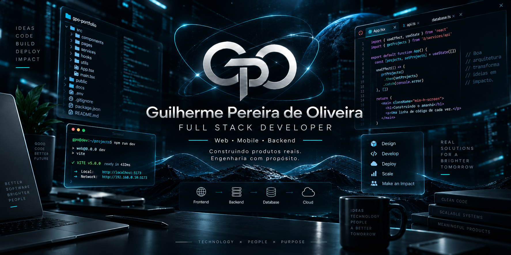

  

# Guilherme Pereira de Oliveira

**Full Stack Developer** · Web · Mobile · Backend

> Construindo produtos reais. Engenharia com propósito.

Brasília, DF · Aberto a oportunidades

[Portfólio](https://guilhermegpo.github.io/meu-perfil/) · [LinkedIn](https://www.linkedin.com/in/guilhermeoliveira-gpo/) · [E-mail](mailto:guilhermegpo.dev@gmail.com)

## Sobre

Desenvolvo aplicações web, mobile e backend, do levantamento da necessidade à arquitetura, à modelagem de dados, à interface, à validação e à evolução do software. Já implantei uma aplicação web interna e mantenho sistemas operacionais e produtos próprios.

Gosto de transformar processos reais em produtos organizados e seguros. Nos projetos que mantenho, isso significa regras de acesso no banco, testes automatizados, decisões de arquitetura registradas, versionamento e documentação que acompanham o código.

## Projetos em destaque

### Meu Chamado · `0.2.0-alpha.4`

`Flutter` `Dart` `Riverpod` `Drift / SQLite` `Android` `GitHub Actions`

Aplicativo Android offline-first para organizar usuários e chamados em um Workspace local: banco local criptografado, controle de acesso por papéis (RBAC), PIN com biometria opcional, 17 ADRs e 300 testes automatizados. Em alpha.

[Case study](https://guilhermegpo.github.io/meu-perfil/projetos/meu-chamado/) · [GitHub](https://github.com/guilhermegpo/meu-chamado)

### Controle de Chaves

`Capacitor` `Android` `JavaScript` `PWA` `Supabase` `Edge Functions`

Aplicativo Android e PWA para controle de chaves e movimentação de veículos de uma frota: perfis de acesso com Row Level Security, histórico e auditoria, login por biometria e atualização obrigatória com liberação gradual. 127 testes automatizados. Código privado.

[Case study](https://guilhermegpo.github.io/meu-perfil/projetos/controle-de-chaves/)

### Sistema de gestão de cursos

`React` `TypeScript` `TanStack Router` `Tailwind CSS` `Supabase` `PWA`

Aplicação web para planejar e acompanhar cursos, com escalas, solicitações, permissões, auditoria e importação e exportação de dados. Código privado.

[Case study](https://guilhermegpo.github.io/meu-perfil/projetos/sistema-gestao-cursos/)

### Sistema de escalas de serviço

`React` `TypeScript` `TanStack Router` `Tailwind CSS` `Supabase` `PWA`

Aplicação web interna para organização e gestão de escalas: regras configuráveis, geração com prévia e publicação, trocas e adiantamentos, indisponibilidades, aprovações, permissões, auditoria, PDF e importação e exportação. Projeto interno; código privado.

[Case study](https://guilhermegpo.github.io/meu-perfil/projetos/sistema-escalas-servico/)

### Família Apps Meu

Produtos pessoais voltados a organização, rotina e autonomia, com o mesmo símbolo "M" e identidade própria em cada um:
[Meu Chamado](https://guilhermegpo.github.io/meu-perfil/projetos/meu-chamado/) (alpha `0.2.0-alpha.4`),
[Meu Financeiro](https://guilhermegpo.github.io/meu-perfil/projetos/meu-financeiro/) (em desenvolvimento) e
[Meu Treino](https://guilhermegpo.github.io/meu-perfil/projetos/meu-treino/) (em desenvolvimento).

### Portfólio

`Astro` `TypeScript` `GitHub Actions`

Este mesmo site, em Astro estático: responsivo, acessível, com SEO, animações e 3D feitos só com CSS, stack e métricas calculadas a partir dos repositórios e verificação automática no CI. Lighthouse local: 100 em desempenho no desktop e 96–97 no mobile; 100 em acessibilidade, boas práticas e SEO nos dois.

[Ver o site](https://guilhermegpo.github.io/meu-perfil/) · [GitHub](https://github.com/guilhermegpo/meu-perfil)

## Stack principal

**Web** `React` `TypeScript` `JavaScript` `TanStack Router` `Tailwind CSS` `Astro` `Vite` `PWA`

**Mobile** `Flutter` `Dart` `Riverpod` `Capacitor` `Android`

**Backend e dados** `Supabase` `PostgreSQL` `Row Level Security` `Edge Functions` `SQLite (Drift)`

**Qualidade e entrega** `Git` `GitHub Actions` `Vitest` `Flutter Test` `ESLint` `Cloudflare Workers`

Cada item foi detectado no código dos meus projetos; o portfólio mostra em quantos aparece.

## Como construo software

- **Offline-first.** O banco local é a fonte de trabalho; a rede é opcional.
- **Acesso no banco.** RBAC e Row Level Security decidem quem pode o quê; esconder um botão nunca é a única barreira.
- **Dados.** Esquema versionado em migrações e regras críticas em funções transacionais.
- **Testes e CI.** Suítes automatizadas e GitHub Actions em pull requests, com verificação antes de cada publicação.
- **Decisões registradas.** ADRs com contexto e alternativas descartadas.
- **Versionamento e documentação.** SemVer, changelog, Conventional Commits, modelo de ameaças e guias que acompanham o código.
- **Auditoria.** Eventos sensíveis registrados e consultáveis.
- **Interface.** Responsividade, acessibilidade e desempenho verificados por script.

## Em números

- **427** testes automatizados, nos dois projetos que têm suíte (300 em Flutter e 127 em Vitest)
- **17** ADRs, no Meu Chamado
- **24** tecnologias detectadas em **5** projetos auditados

Números recalculados executando as suítes em 21/09/2026.

## Experiência prática

Construí e implantei uma aplicação web interna em ambiente institucional — do levantamento de requisitos e mapeamento de fluxos à modelagem de dados, documentação e suporte aos usuários — e desenvolvo sistemas operacionais internos e aplicativos próprios, web e mobile.

## Formação

Tecnólogo em Análise e Desenvolvimento de Sistemas — Universidade Cruzeiro do Sul

Conclusão: 2026

## Contato

- [Portfólio](https://guilhermegpo.github.io/meu-perfil/)
- [LinkedIn](https://www.linkedin.com/in/guilhermeoliveira-gpo/)
- [GitHub](https://github.com/guilhermegpo)
- [E-mail profissional](mailto:guilhermegpo.dev@gmail.com)
