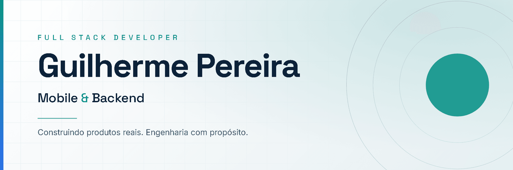

<picture>
  <source media="(prefers-color-scheme: dark)" srcset="assets/banner-dark.png">
  <source media="(prefers-color-scheme: light)" srcset="assets/banner-light.png">
  
</picture>

# Guilherme Pereira

**Desenvolvedor Full Stack | Mobile & Backend** · Brasília, DF — Brasil

Formado em Análise e Desenvolvimento de Sistemas, com experiência prática
desenvolvendo e implantando uma aplicação web interna que entrou em uso real.
Hoje construo produtos web e mobile próprios, com atenção a arquitetura,
experiência de uso e qualidade de software.

[**Portfólio**](https://guilhermegpo.github.io/meu-perfil/) · [LinkedIn](https://www.linkedin.com/in/guilhermeoliveira-gpo/) · [Projetos](https://guilhermegpo.github.io/meu-perfil/#projetos)

---

## Atualmente desenvolvendo

> [!NOTE]
>
> ### Meu Chamado · `v0.1.0-alpha.1` · em desenvolvimento
>
> Aplicativo Flutter para Android com arquitetura multiusuário e multichamado,
> persistência offline e controle de acesso baseado em papéis.
>
> **Stack** — Flutter · Dart · Riverpod · Drift · SQLite
>
> **O que já existe:** 28 testes automatizados · CI Android · schema versionado
> com migração · RBAC `ADMIN` / `MODERATOR` / `USER` · fundação offline-first ·
> versionamento semântico
>
> [Repositório](https://github.com/guilhermegpo/meu-chamado) · [Release v0.1.0-alpha.1](https://github.com/guilhermegpo/meu-chamado/releases/tag/v0.1.0-alpha.1)

---

## Projetos em destaque

### Meu Chamado

`Mobile` · `Em desenvolvimento`

Aplicativo Android offline-first para organizar usuários e chamados em um
Workspace local. A alpha entrega a fundação — onboarding, persistência, papéis e
ciclo de vida dos chamados — sem apresentar integrações planejadas como
concluídas.

**Stack** — Flutter · Dart · Riverpod · Drift · SQLite

[Repositório](https://github.com/guilhermegpo/meu-chamado) · [Release](https://github.com/guilhermegpo/meu-chamado/releases/tag/v0.1.0-alpha.1)

### Meu Perfil

`Portfolio / Web` · `Finalizado, em evolução contínua`

Portfólio profissional estático. Cada projeto é apresentado como case, com página
própria: problema, participação, solução e resultado.

**Stack** — Astro · TypeScript

Lighthouse 100/100/100/100 em desktop e mobile · contraste verificado contra
WCAG AA por script no CI · publicação contínua no GitHub Pages.

[Acessar o site](https://guilhermegpo.github.io/meu-perfil/) · [Código](https://github.com/guilhermegpo/meu-perfil)

### Sistema de gestão de cursos — ILA/FAB

`Full Stack` · `Case real`

Aplicação web interna desenvolvida e implantada para apoiar o planejamento, a
coordenação e o gerenciamento de cursos. Atuei no levantamento de requisitos, no
mapeamento de fluxos, no frontend, na estrutura de dados, na implantação, na
documentação e no suporte aos usuários.

**Stack** — React · TypeScript · TanStack Router · Supabase · PostgreSQL

Sistema interno: o código e as telas não são públicos.

[Ver o case completo](https://guilhermegpo.github.io/meu-perfil/projetos/sistema-ila-fab/)

---

## Stack

**Frontend** — React · TypeScript · JavaScript · Astro

**Mobile** — Flutter · Dart

**Backend e dados** — Supabase · PostgreSQL · SQL · APIs REST

**Ferramentas** — Git · GitHub · Docker · Postman · VS Code · IntelliJ IDEA

---

## Engenharia e práticas

Interface é metade do trabalho. A outra metade é o que garante que a entrega
continue funcionando depois.

**Versionamento** — branch protection em `main` e `develop`, pull request com
status checks obrigatórios, Conventional Commits e versionamento semântico.

**Automação** — GitHub Actions em todo pull request: formatação, tipos, testes e
build. Publicação contínua a cada merge.

**Qualidade** — testes automatizados onde a lógica quebra em silêncio, e
verificação própria onde a ferramenta pronta não cobre: um script mede contraste
WCAG lendo os tokens do CSS e valida metadados e links internos no build.

**Arquitetura** — decisões relevantes viram Architecture Decision Records, com
contexto, alternativas e consequências. Privacidade por padrão: nenhum dado real
de pessoas em repositório público.

---

## Experiência

### Instituto de Logística da Aeronáutica — ILA/FAB

**Soldado Temporário** · 08/2023 — 06/2026 · Guarulhos, SP

Levantamento de requisitos e mapeamento de fluxos junto aos usuários,
desenvolvimento e implantação de aplicação web interna, modelagem do banco de
dados, documentação e suporte após a entrega.

### Torre Contabilidade LTDA

**Auxiliar Fiscal** · 02/2022 — 07/2023 · São Paulo, SP

Rotina fiscal com prazos legais rígidos e alto volume de informação.

---

## Formação

**Análise e Desenvolvimento de Sistemas** — Universidade Cruzeiro do Sul · 02/2022 — 07/2026 · Concluído

---

## Vamos conversar?

Aberto a oportunidades como desenvolvedor **Full Stack**, **Mobile** ou
**Backend**.

[Portfólio](https://guilhermegpo.github.io/meu-perfil/) · [LinkedIn](https://www.linkedin.com/in/guilhermeoliveira-gpo/) · [guilhermegpo.dev@gmail.com](mailto:guilhermegpo.dev@gmail.com)
